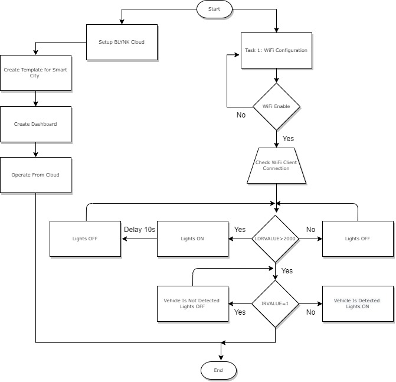
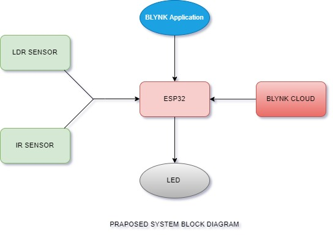

# 💡 Smart Street Light System (IoT)

An energy-efficient, IoT-enabled street lighting system written in C. This project automates street illumination based on ambient light and motion detection to optimize power consumption.

## 🛠️ Hardware Architecture
*   **Microcontroller:** ESP32
*   **Sensors:** 
    *   Light Dependent Resistor (LDR) for ambient light sensing.
    *   PIR Motion Sensor for object detection.
*   **Actuators:** LEDs

*   ## 📊 System Flowchart
This flowchart illustrates the decision-making logic of the microcontroller based on light levels and motion detection:

## ⚡ Circuit Diagram
Below is the hardware wiring diagram showing the connections between the sensors and the controller:

## 🗂️ Project Structure
*   `/src`: Contains all C source code and hardware drivers.
*   `/hardware`: Contains the circuit schematic and pin wiring.
*   `/docs`: Demo images and system flowcharts.

## 🚀 How It Works
1.  The system continuously monitors ambient light via the LDR.
2.  During daylight, the lights remain completely off.
3.  At dusk, lights turn on, after some time it will turn automatically off to save power.
4.  When the PIR sensor detects motion (a car or pedestrian), the lights dynamically ramp up to 100% brightness for a set duration.
5.  These activity also seen and save on cloud platform.
6.  Cloud platform also have the control, if the error occur you can bypass the automatic system and operate it manually. 
